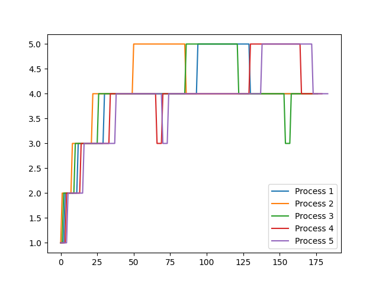
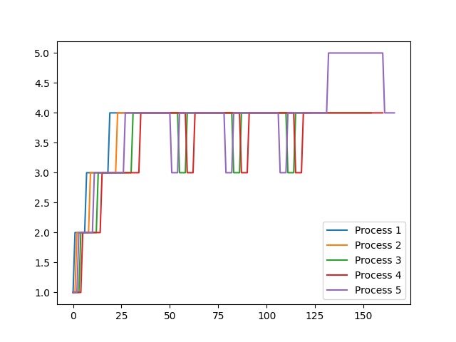
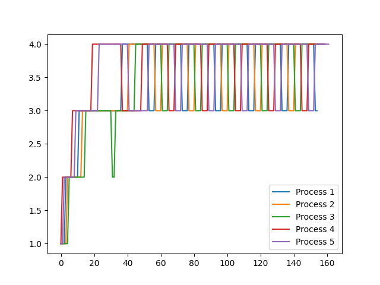

# XV6 Implementation Report

```
xv6 is a re-implementation of Dennis Ritchie's and Ken Thompson's Unix
Version 6 (v6).  xv6 loosely follows the structure and style of v6,
but is implemented for a modern RISC-V multiprocessor using ANSI C.

ACKNOWLEDGMENTS

xv6 is inspired by John Lions's Commentary on UNIX 6th Edition (Peer
to Peer Communications; ISBN: 1-57398-013-7; 1st edition (June 14,
2000)).  See also https://pdos.csail.mit.edu/6.1810/, which provides
pointers to on-line resources for v6.

The following people have made contributions: Russ Cox (context switching,
locking), Cliff Frey (MP), Xiao Yu (MP), Nickolai Zeldovich, and Austin
Clements.

We are also grateful for the bug reports and patches contributed by
Takahiro Aoyagi, Silas Boyd-Wickizer, Anton Burtsev, carlclone, Ian
Chen, Dan Cross, Cody Cutler, Mike CAT, Tej Chajed, Asami Doi,
eyalz800, Nelson Elhage, Saar Ettinger, Alice Ferrazzi, Nathaniel
Filardo, flespark, Peter Froehlich, Yakir Goaron, Shivam Handa, Matt
Harvey, Bryan Henry, jaichenhengjie, Jim Huang, Matúš Jókay, John
Jolly, Alexander Kapshuk, Anders Kaseorg, kehao95, Wolfgang Keller,
Jungwoo Kim, Jonathan Kimmitt, Eddie Kohler, Vadim Kolontsov, Austin
Liew, l0stman, Pavan Maddamsetti, Imbar Marinescu, Yandong Mao, Matan
Shabtay, Hitoshi Mitake, Carmi Merimovich, Mark Morrissey, mtasm, Joel
Nider, Hayato Ohhashi, OptimisticSide, Harry Porter, Greg Price, Jude
Rich, segfault, Ayan Shafqat, Eldar Sehayek, Yongming Shen, Fumiya
Shigemitsu, Cam Tenny, tyfkda, Warren Toomey, Stephen Tu, Rafael Ubal,
Amane Uehara, Pablo Ventura, Xi Wang, WaheedHafez, Keiichi Watanabe,
Nicolas Wolovick, wxdao, Grant Wu, Jindong Zhang, Icenowy Zheng,
ZhUyU1997, and Zou Chang Wei.


The code in the files that constitute xv6 is
Copyright 2006-2022 Frans Kaashoek, Robert Morris, and Russ Cox.

ERROR REPORTS

Please send errors and suggestions to Frans Kaashoek and Robert Morris
(kaashoek,rtm@mit.edu).  The main purpose of xv6 is as a teaching
operating system for MIT's 6.1810, so we are more interested in
simplifications and clarifications than new features.

BUILDING AND RUNNING XV6

You will need a RISC-V "newlib" tool chain from
https://github.com/riscv/riscv-gnu-toolchain, and qemu compiled for
riscv64-softmmu.  Once they are installed, and in your shell
search path, you can run "make qemu".
```

# Specification 1 - System Calls

## Part 1 - `strace`
Added a system call `trace` and accompanying user program `strace`

SYNTAX: `strace mask command [args]`
```
- mask: a bit mask of the index number of syscalls to trace
- command: command to be traced
- args: arguments to the command
```
1. Added a field `mask` to `struct proc` which represents the mask of the strace syscall
2. Added a syscall `sys_trace()` in `kernel/sysproc.c` which sets the mask given to the mask of the calling process.
3. Defined it as 22nd system call in `kernel/syscall.h`.
4. Modified `syscalls()` function in `kernel/syscall.c` to print any syscalls executed according to mask. Also added `syscalls_args` and `syscallsnames` arrays.
5. Added user program `user/strace.c` to execute the program and also added required entries to `Makefile` and `usys.pl`.

## Part 2 - `sigalarm` and `sigreturn`
Added two new syscalls `sigalarm` and `sigreturn` to the kernel.

SYNTAX: `sigalarm(interval,handler)` and `sigreturn()`
```
- sigalarm calls the handler function after every interval number of ticks.
- sigreturn resets the the process state to before the handler function was called.
```
1. Added four fields `cputicks`, `handler`, `passed_cputicks` and `initial_trapframe` to `struct proc` which represents -
    * `cputicks` - interval after which handler has to be called
    * `handler `- handler function called after cputicks ticks
    * `passed_cputicks` - number of ticks passed after last call of handler
    * `initial_trapframe` - stores the state of the calling process before shifting to the handler function.
2. Initialized all variables to 0 in `allocproc` in `kernel/proc.c`
3. Defined `sys_sigalarm` and `sys_sigreturn` as the 23rd and 24th syscall in `kernel/syscall.h`
4. Added entries to `syscalls`,`syscallnames` and `syscalls_args` in `kernel/syscall.c`. Also added an entry to `user/usys.pl`.
5. Added the system call `sys_sigalarm` to `kernel/sysproc.c` which sets the `cputicks` and `handler` fields of the calling process.
6. Added the system call `sys_sigreturn` to `kernel/sysproc.c` which moves the initial trapframe to the process's trapframe to restore initial conditions of the process.
7. Added a condition to `kernel/usertrap.c` which checks if the passed_cputicks has passed the cputicks variable after every tick and moves the handler function to the process's program counter.


# Specification 2 - Scheduling
Firstly we modified Makefile to add `SCHEDULER` macro while compiling which takes values FCFS, LOTTERY, PBS, MLFQ, DEFAULT
```c
CFLAGS += "-D$(SCHEDULER)"

```
## a. DEFAULT - Round Robin Scheduling
- Default scheduling implemented in xv6
## b. FCFS - First Cum First Serve Scheduling
This policy selects the processes to schedule in order of their creation time i.e the number of ticks at which the process was created. The process is allowed to run till it no longer requires CPU time. Also processes cannot be preempted here.
### How we implemented FCFS
1. In `kernel/proc.h` 
- Added `int ctime` to `struct proc` to store creation time
2. In `kernel/proc.c` 
- In `allocproc()` we intialized `p->ctime=ticks` 
- In `scheduler()` under `#ifdef FCFS` we iterated over all current processes and scheduled those first that are `RUNNABLE` and have lowest `ctime`

## c. LOTTERY - Lottery Based Scheduling
This policy assigns a certain number of tickets to each process. A random ticket number is then drawn each time to decide which process to schedule based in which process has that number.\
This is similar to FCFS, just that the scheduling criteria is lottery based.
### How we implemented LOTTERY
1. In `kernel/proc.h` 
- Added `int tickets` to `struct proc` to store number of tickets
2. In `kernel/syscall.c` 
- Add `int settickets(int x)` as a syscall which changes number of tickets for a process to x
3. In `kernel/proc.c` 
- In `allocproc()` we intialized `p->tickets=1` as default  
- Then we calculated `total_tickets` over all `RUNNABLE` processes
- Selected a `lottery_winner` ticket number with `rand()`
- In `scheduler()` under `#ifdef LOTTERY` scheduled those `RUNNABLE` processes first which have the `lottery_winner` ticket number and ran them till completion

## d. PBS - Priority Based Scheduling
- This policy assigns a priority to each process based on parameters, 

`niceness`= `int((sleepTime / sleepTime + runTime) * 100)`\
Static Priority (`SP`) = [0,100] -> set with `set_priority `function\
Dynamic Priority (`DP`) = `max(0, min(SP - niceness + 5),100)`

Processes with lower `DP` are scheduled first. Also in case `DP` is same the tie is broken in the given order
1. Processes that have been scheduled lesser number of times are given higher priority
2. Processes with higher `p->ctime` (start time) are given more priority
### How we implemented PBS
1. In `kernel/proc.h` 
- Added the following in `struct proc`
```
int scheduled              
int sleepTime              
int runTime                
int SP                     
int DP
```
2. In `kernel/trap.c`
- Create function `updateTime()` that does 
```c
if(p->state == SLEEPING)
    p->sleepTime++;
else if(p->state == RUNNING)
    p->runTime++;
```
- call `updateTime()` in `clockintr()`
3. In `kernel/proc.c` 
- Intitalize the above parameters to 0 and `SP=60` as default in `allocproc()`
- In `scheduler()` under `#ifdef PBS` iterate through `RUNNABLE` processes and calculate `niceness`(default=5) and `DP` dynamically keeping a global process `highP`,  which always has highest `DP`
- After iteration schedule `highP` and increment no. of times the process has been scheduled i.e `highP->scheduled++`
4. Declare function
```
int set_priority(int new_priority, int pid)
```
- In `kernel/sysproc.c` , here set `SP=priority` , reset sleepTime and runTime to update `niceness`
- Also compare new and old `DP` and reschedule if new `DP` is lesser i.e. `yield()`
- Make `set_priority` a user call in `user/user.h`. 
- Create `setpriority.c` that takes in user parameters of priority and process pid.


## e. MLFQ - Multi Level FeedBack Queue Scheduling
This policy involves 5 queues numbered 0-4 from highest to lowest priority.\
Processes from the highest queue are popped and ran for the time slice of the queue.
- If any process exceeds this time slice it is pushed to end of the next lower queue.
- If any process voluntarily leaves for I/O it is pushed back to the end of the same queue 

`How can a process take advantage of this?`  
```
If an process is aware of the time slice of a queue, then to maximize the amount of CPU time it gets, 
it can relinquish control of the CPU just before the time slice gets over i.e. before it is preempted. 
It will then immediately return and get pushed back to the same queue. 
Thus it avoids being pushed into lower priority queues.
```
- If a process is waiting for more than a threshold time limit in a queue, it is pushed to the next higher priority queue and its wait time is reset to 0. (`Aging`)
- Completed processes leave the system
### How we implemented MLFQ
1. In `kernel/proc.h`
- Add the following parameters to `struct proc`
```
int queuetime               
int currq                  
int inside                
int timeStamp[250]          
int timeRemaining
```
2.  In `kernel/proc.c`
- Implement a `struct Queues` which contains all the priority queues and arrays for the processes in each queue.
- In `allocproc()` initialize `p->queuetime = ticks` , `p->timeRemaining=1`, and the rest to 0.
-  In `scheduler()` under `#ifdef MLFQ` 
    - iterate through `RUNNABLE` processes and remove processes where `p->queuetime > AGELIMIT` (our `AGELIMIT=100`). Decrement `p->currq` and push to end of higher priority queue.
    - iterate through `RUNNABLE` processes in all queues and run the highest priority ones by pushing them out.
    Assign time slice for running as `runP->timeRemaining = 1 << runP->currq`
- In `kill()` if process is killed remove from queue.
- In `updateTime()` while process is `RUNNING` do 
```c
p->timeRemaining--;
p->timeStamp[ticks-p->ctime] = p->currq+1;
```
3. In `kernel/trap.c`
- In `usertrap()` and `kerneltrap()` whenever there is a CPU timerInterrupt (`which_dev == 2`), 
    - Iterate till `currq`, if any higher priority queue is empty, preempt the `RUNNING` process.
    - If time slice is over (`p->timeRemaining<=0`), push process to end of lower priority queue and `yield()`.

# Specification 3 - Copy-on-Write Fork
This specification required us to implement copy on write fork which improves performance by only copying pages of memory for children only when one of them has to write on one of the pages.

1. Added a `PTE_COW` in `kernel/riscv.h` flag which represents whether a page of memory is CoW or not.
2. Added a struct `Ref` to `kernel/kalloc.c` which contains a `spinlock` and an array of `references` which represent the number of processes which are referring to a page of memory in read-only manner.
3. Made two functions `addReference` and `copyndecref` in `kernel/kalloc.c`. The first one increases the reference count to a page. The second function makes a copy of the page of memory and decreases the references to it.
4. Added a function `pagefhandler` to `kernel/kalloc.c`. It is being called in `usertrap()` in `kernel/usertrap.c` when scause value is 15. This page fault handler calls the `copyndecref` function which makes a copy of the faulted memory, then maps these pages of memory to the pagetable of the process which caused the fault. It also unmaps the original memory which faulted.
5. Modified `kfree()` in `kernel/kalloc.c` to only free the page if there are no references to the page.
6. Modified `copyout()` in `kernel/vm.c` to cause a page fault exception whenever it is called so if it is a CoW page, the function handles it.
7. Modified `uvmcopy()` in `kernel/vm.c` to increase references to the page whenever it is called and also remove the write flag and add the CoW flag so that the hardware raises a page fault when the process tries to write on it.

# Specification 4 - Comparing Scheduling

## Comparison
- Analysis between the average running time and wait time of all scheduling algorithms is as follows
-  Note: we have not added IO processes to FCFS and LOTTERY

| Scheduling Method | Avg. RunTime      | Avg. WaitTime    
| ----------------- | ----------------- | -------- |
| RR                | 14                | 108      |
| FCFS              | 30                | 138      |
| LOTTERY           | 29                | 237      |
| PBS               | 14                | 80       |
| MLFQ              | 15                | 101      |

- Thus we infer that the speed of the processes are in the order
```
PBS > MLFQ > RR > FCFS > LOTTERY
```
## Observations
1. Our `MLFQ` isn't the fastest. This could be attributed to the Queue data structure we implemented using an array which makes operations slower.
2. `LOTTERY` is very slow as for each process to be executed it needs to wait for its ticket to be drawn which could take a very long time.
3. `PBS` and `RR` are faster because of preemption whereas `FCFS` lacks the same.

## MLFQ Analysis
- Here we have varied the `AGELIMIT` with values 30,24,16
- The x axis represents the tick no., the y axis represents the queue no. (1-5)
- The graph shows which queue the process is in at a particular tick no.
### 1. AGELIMIT = 30

### 2. AGELIMIT = 24

### 3. AGELIMIT = 16


- In graph2 which has lower `AGELIMIT`, processes spent more time in queue 4, which is of higher priority. Otherwise with higher `AGELIMIT` processes spend more time in queue 5.
- We observe that at a lower the `AGELIMIT`, more no. of processes are in higher priority queues, as they keep getting preempted(like `RR`). Higher the `AGELIMIT` more the wait time in lower priority queues. Thus we must find an optimal inbetween `AGELIMIT` such that the purpose and advantages of `MLFQ` are achieved. 


